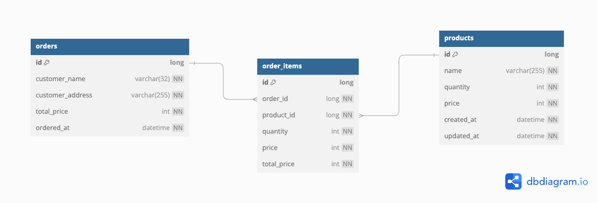

# Pretest

## 사용된 외부 라이브러리

### Spring Boot Starter Validation

- 입력값 검증을 위한 Bean Validation 기능 제공
- DTO 클래스의 필드 유효성 검사에 활용

### Spring Boot Starter Data JPA

- JPA를 통한 데이터베이스 접근 추상화 계층 제공
- 엔티티 매핑 및 레포지토리 구현에 활용

### H2 Database

- 인메모리 관계형 데이터베이스 제공
- 개발 및 테스트 환경에서의 데이터 저장소로 활용

### Apache POI

- Microsoft Office 파일 포맷 처리 라이브러리
- 엑셀 파일 파싱 및 데이터 추출에 활용

## 기능

### 단건 API 주문 등록

`POST /orders/single`

#### Request

- Body

```json
{
  "customer_name": "주문자 이름",
  "customer_address": "주문자 주소",
  "items": [
    {
      "product_id": 1,
      "product_name": "상품 이름 1",
      "quantity": 2
    },
    {
      "product_id": 2,
      "product_name": "상품 이름 2",
      "quantity": 1
    }
  ]
}
```

#### Response

```json
{
  "order_id": 12345,
  "customer_name": "주문자 이름",
  "customer_address": "주문자 주소",
  "total_price": 3698000,
  "ordered_at": "2025-02-26 22:50:00",
  "products": [
    {
      "product_id": 1,
      "product_name": "상품 이름 1",
      "quantity": 2,
      "price": 2499000,
      "total_price": 4998000
    },
    {
      "product_id": 2,
      "product_name": "상품 이름 2",
      "quantity": 1,
      "price": 1199000,
      "total_price": 1199000
    }
  ]
}
```

### 엑셀 주문 등록

`POST /orders/bulk`

#### Request

- Body (Form-Data)

```
file: 주문목록.xlsx (Excel 파일)
```

Excel 파일 형식

| 주문자명 | 주문자 주소 | 상품 정보 (JSON)                                                                                                         |
| ----- | -------- |----------------------------------------------------------------------------------------------------------------------|
|  고객 1 | 서울시 강남구 | [{"product_id": 1, "product_name": "상품 1", "quantity": 2}, {"product_id": 2, "product_name": "상품 2", "quantity": 1}] |
| 고객 2 | 부산시 해운대구 | [{"product_id": 3, "product_name": "상품 3", "quantity": 1}]                                                           |

#### Response

```json
{
  "total_order": 2,
  "success_orders": [
    {
      "order_id": 12345,
      "customer_name": "고객 1",
      "customer_address": "서울시 강남구",
      "total_price": 3698000,
      "ordered_at": "2025-02-26 22:50:00",
      "products": [
        {
          "product_id": 1,
          "product_name": "상품 1",
          "quantity": 2,
          "price": 2499000,
          "total_price": 4998000
        },
        {
          "product_id": 2,
          "product_name": 2,
          "quantity": 1,
          "price": 1199000,
          "total_price": 1199000
        }
      ]
    }
  ],
  "failed_orders": [
    {
      "customer_name": "고객 2",
      "customer_address": "부산시 해운대구",
      "reason": "상품의 재고가 부족합니다."
    }
  ]
}
```

## ERD

